# MADS-MEDICIMAGE
This repository is dedicated to the group project of the course "Introduction to Deep Learning for Image Analysis and Computer Vision" at the Universeity of Luxembourg. 4 tasks that are asked in the [main PDF of homework](https://github.com/berserkhmdvhb/MADS-MEDICIMAGE/blob/main/homework_file.pdf) are solved and explained in this repository. The implementation and results of tasks 2 and 4 are also provided. In the current README, the solutions are documented and explained.


 `Task 1`
---
Please find the solution in the [main PDF of homework](https://github.com/berserkhmdvhb/MADS-MEDICIMAGE/blob/main/homework_file.pdf), containing all the questions and solution of only task 1.

 `Task 2`
---
Please find the solution in [task2.pdf](https://github.com/berserkhmdvhb/MADS-MEDICIMAGE/blob/main/TASK2/task2.pdf). The code used to generate the plots of the PDF is provided in [task2.m](https://github.com/berserkhmdvhb/MADS-MEDICIMAGE/blob/main/TASK2/task2.m)


 `Task 3`
---
In the following, a brief description of solution of Task 3 is provided:
The initial images are displayed in the following:


<p float="left">

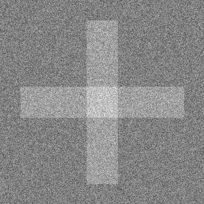
</p>


The [task3.m](https://github.com/berserkhmdvhb/MADS-MEDICIMAGE/blob/main/TASK3/task3.m) file contains the processing implementation of the Abingdon-Cross images. The first step of our processing is to denoise the noisy Abingdon-cross image; this is done using the pre-defined denoiser CNN architecture `DnCNN`, which can be used in the `denoiseImage()` function.

The architecture is represented in this picture:

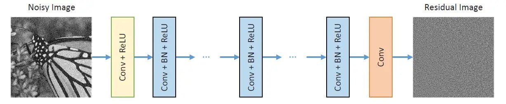

In the following, the denoised version of images using the network are displayed:

<p float="left">

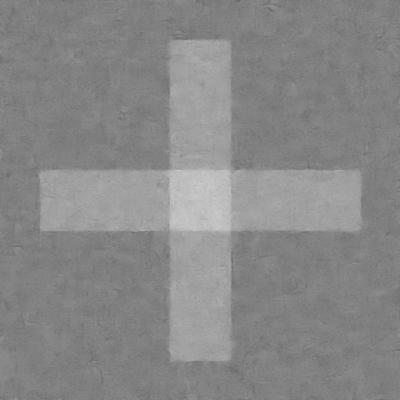
</p>

As one can see, the denoising was rather successful.

After the denoising, the binary segementation is carried out using the `imbinarize()`, which successfully segements the image into "background" and "cross".

The resulting segmented images can be seen here:

<p float="left">

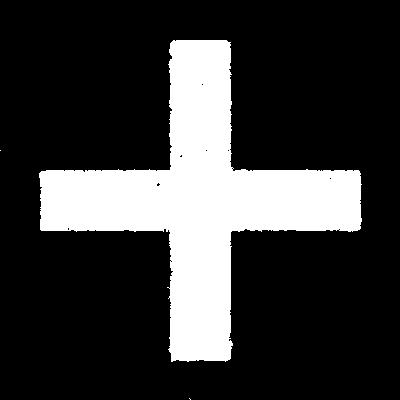
</p>

The area and perimeters are computed using `bwarea()` and `regionprops()` repsectively, which returns a pixel count. The aforementioned quantities are presented in the following table:

| | Area | Perimeters | 
|:-------------:|:-------------:|:-------------:|
| Binary Image | 3.5442e+04 | 1.2507e+03
| Denoised Image | 1.3488e+03 | 3.5347e+04

Finally, the DICE score is used to check how "far apart" both segmentations are. This score returns a value of 0.9947.


 `Task 4`
---

# Installation of ANTs
## Installing Cmake
`Cmake` is a requirement for installing ANTs from source. Choose the [Cmake version](https://cmake.org/download/), and then use it in the `wget` command below

```bash
srun -p batch --time=24:00:0 -N 2 -c 12 --pty bash -i
wget https://github.com/Kitware/CMake/releases/download/v3.25.2/cmake-3.25.2.tar.gz
tar xzf cmake-3.25.2.tar.gz
cd cmake-3.25.2/
./configure --prefix=$HOME
gmake
gmake install
```


## Compile ANTs from source
Instructions of installing ANTs on HPC cluster, partly followed by [this link](https://brianavants.wordpress.com/2012/04/13/updated-ants-compile-instructions-april-12-2012/):

```bash
cd medicimage/
git clone https://github.com/ANTsX/ANTs
mkdir antsbin
cd antsbin
ccmake ../ANTs
```
Navigate into cmake and type `c` and then `g`  then exit back to the
terminal.

```bash
make -j 4
```

Navigate to the root folder contating `ANTs` and `antsbin` 

```bash
cp ANTs/Scripts/* antsbin/ANTS-build/Examples/
```

Now we need to set the bashrc paths accordingly:

```bash
nano ~/.bashrc
```

Add the following paths but adjust it to your own machine:


```bash
export ANTSPATH=/home/users/hvaheb/medicimg/antsbin/ANTS-build/Examples
export PATH=$PATH:$ANTSPATH
```


Do the same steps with `~/.bash_profile`.


**Side Note**: To copy output images from cluster to local machine, the following

```bash
scp -r iris-cluster:/home/users/hvaheb/medicimg/output/ /home/hamed/Documents/Projects/medical/dataset/output/
```


# Image Restoration
The outpus of this section and next section are all stored in this [Google Drive link](https://drive.google.com/drive/folders/1hvrKTuzw4cGJjQkEZDB3G4ZUHOr7O-Gt?usp=sharing).
Samples were chosen from the [BRATS dataset](https://www.med.upenn.edu/cbica/brats2020/data.html) to apply image registration using ANTs software.
A particular sample used is the `BRATS_003.nii.gz` file.

## Header 
The header of nifti files derived from BRATS were checked to have more sense of their format. Using the value of `sform_code` or `qform_code`, the coordinate system of the file is determined.
The values for these codes are defined as following:

| [qs](https://nifti.nimh.nih.gov/nifti-1/documentation/nifti1fields/nifti1fields_pages/qsform.html#refqs) form_code value:        |  (x,y,z) coordinate system refers to:           | 
|:-------------:|:-------------:|
| 0      | Arbitrary coordinates |
| 1      | Scanner-based anatomical coordinates |
| 2 | Coordinates aligned to another file's, or to anatomical "truth" |
| 3 | Coordinates aligned to Talairach-Tournoux Atlas; (0,0,0)=AC, etc. |
| 4 | MNI 152 normalized coordinates. |

The [reg.py](https://github.com/berserkhmdvhb/MADS-MEDICIMAGE/blob/main/TASK4/header/header.py) script is written to check for all `nii` files in a directory with name `imagesTr` and to append `TRUE` if the the qs-form had value 4, i.e., the image was registered with MNI template.
For all the images in BRATS dataset, the header's number was 4 i.e., they were scanner-based based coordinates.


## Mapping to Templates
In this sections, all `nii` files' visualizations are obtained from screenshots of the [ITK-SNAP](http://www.itksnap.org/pmwiki/pmwiki.php) software.

The initial sample image `BRATS_003.nii.gz` is visualized in the following:


<p float="left">
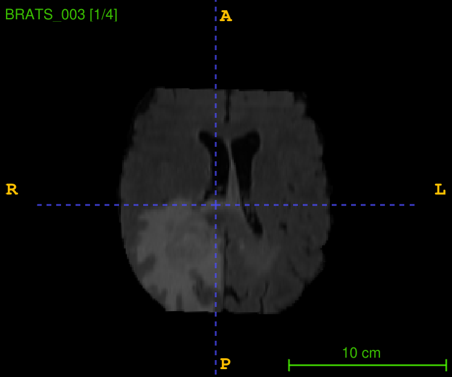
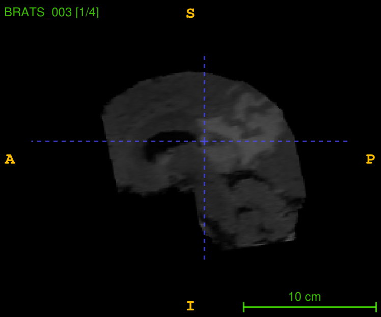
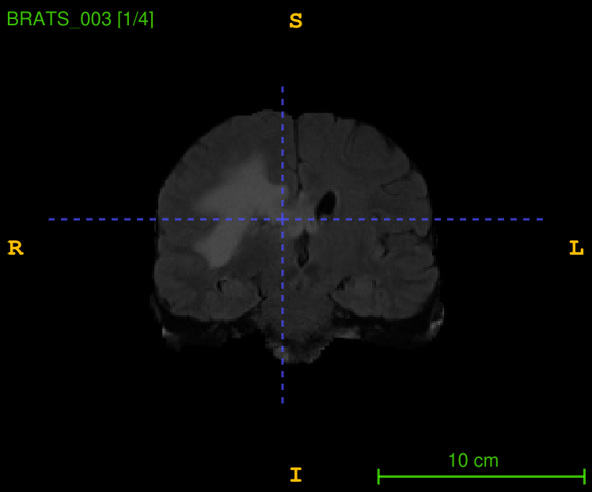
</p>

Evidenced by the figures, there is a bit of tilt in the horizontal direction, which is speculated to be attributed to the scanner-based (x,y,z) coordinate system, as investigated in [Header](#Header). To restore image to a proper alignment space, the [MNI](#MNI) template and [segmentation](#MNI) template are used.  The former is the standard template of MNI space, while the latter contains 3 big meta-brain structure, which is why it is called segmentation, as it contains the last segemented component of the former template.


### MNI

Provided in the cluster is the MNI space coordinated image `t1.nii`, whic is used to transform the original image `BRATS_003.nii` to `t1.nii`, which is also called the moving image.
The `antsRegistration` commaned was used to map the original image to the MNI space, as follows:

```
antsRegistrationSyNQuick.sh -d 3 -f /scratch/users/ahusch/MSDS_19/MNI_SPACE/t1.nii -m /scratch/users/ahusch/MSDS_19/DATASETS/BRATS_dataset/imagesTr/BRATS_003.nii.gz -o /home/users/hvaheb/medicimg/output/003/BRATS_003_mapped -j 12
```

In below the outputs are presented:


<p float="left">
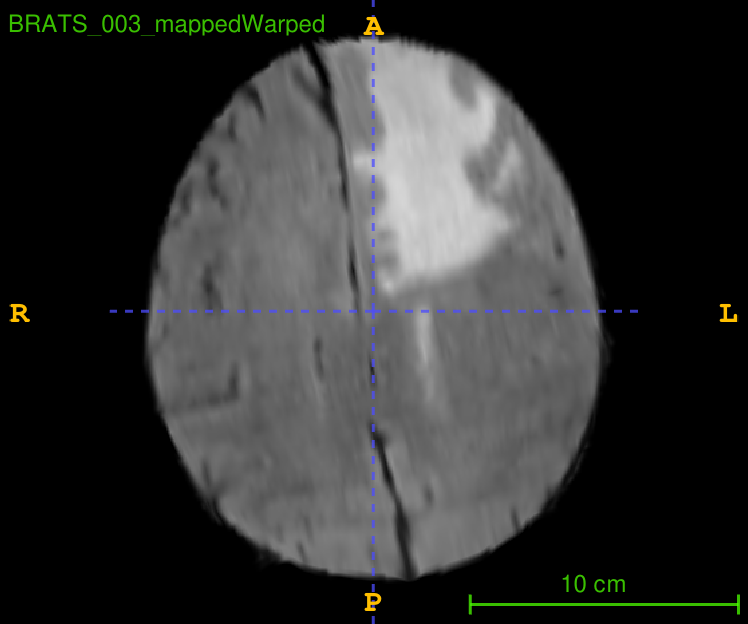
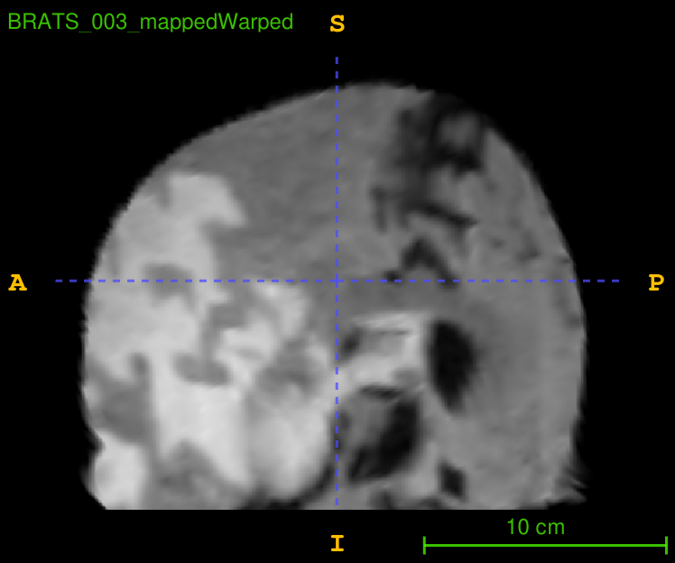
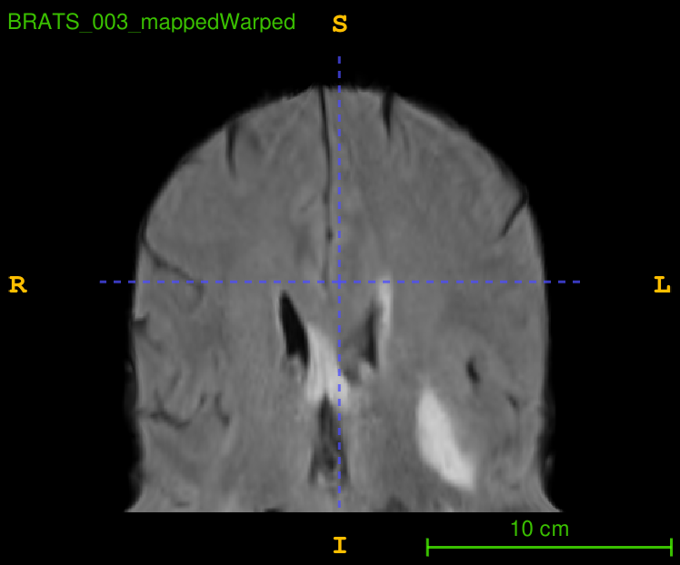
</p>


### MNI-Segmented
Provided in the cluster is the MNI space coordinated image `simple_segmentation.nii` but it is segmented to have only the inner structure, which is used to transform the original image `BRATS_003.nii` to `t1.nii`, which is also called the moving image.
<p float="left">
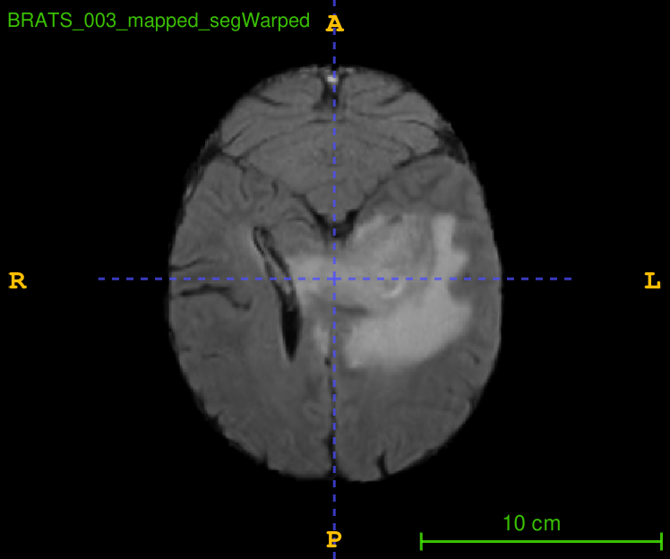
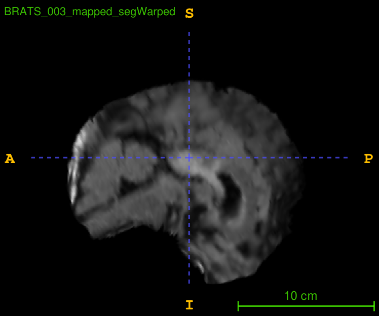
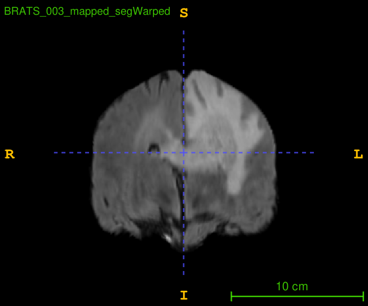
</p>


```
antsRegistrationSyNQuick.sh -d 3 -f /scratch/users/ahusch/MSDS_19/MNI_SPACE/simple_segmentation.nii  -m /scratch/users/ahusch/MSDS_19/DATASETS/BRATS_dataset/imagesTr/BRATS_003.nii.gz -o /home/users/hvaheb/medicimg/output/seg/003/BRATS_003_mapped_seg -j 12
```

# Image Segmentation
Using the nii filled registered (normalized) to MNI space in [Image Restoration](#Image-Restoration), this section is dedicated to segmenting tumor from other regions of brain.

The following syntax was attempted using [Atropos](https://manpages.debian.org/experimental/ants/Atropos.1.en.html), a segemntation tool from Ants:

```
Atropos -d 3 -a /home/hamed/Documents/Projects/medical/dataset/imagesTr/BRATS_003.nii -c 5 -i 'KMeans[5]' -o BRATS_003_seg

Atropos -d 3 -a /home/users/hvaheb/medicimg/output/seg/BRATS_003_mapped_segWarped.nii.gz -c 5 -m 'MLP-EM' -i 100 -k 'KMeans' -o /home/users/hvaheb/medicimg/output/segment/BRATS_003_segmented
```

There was not output, hence I proceeded with Python.
Please find the [Python notebook for segmentation](https://colab.research.google.com/drive/1NDcPMk2WL8Rw3PYMl8VBdXeWPj4Mivqy?usp=sharing).


## Visualization

In below the normalized nitfi image of `BRATS_003` as well as its label (the tumor provided in the directory segmentation) are visualized.

### BRATS_003 Normalized


### BRATS_003 Label

## Implementation

### Simple Effects

Using [Nilearn](https://nilearn.github.io/stable/index.html), the following segmentation plots are derived from the nii files of `BRATS_003`

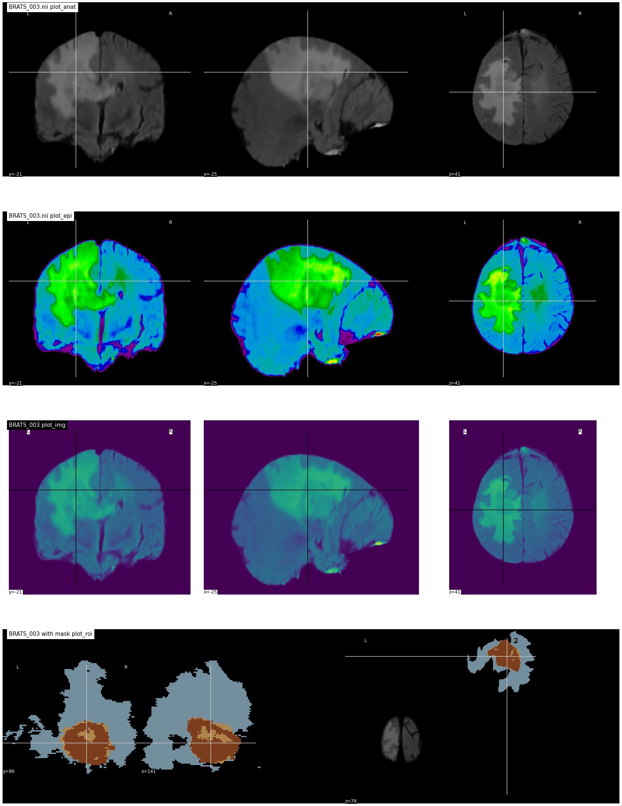

Due to time limit, only one sample, which is `BRATS_003` is considered for training set, and sample `BRATS_200` is considered for test set.


## Statistics
The idea to quantify where tumors are more likely to be found could be handeled in the following manner:

Firstly, segment the images that are available into "Tumor" and "Non-Tumor" areas, using a binary segmentation.

After binary segmentation, one could transform them into grayscale images, with black being 0 and the former 1 (white) taking the value 255. This would be done for all images in the dataset. Now in order to get a general picture on where one would predominantly find the tumors, one could create an average of the voxels. This only works because we find ourselves in the same, standardized MNI space.

If the images all now have the same format and the same size, we can average (pixel-by-pixel) over the whole dataset, and display the "average" image of the dataset. This means that regions were tumors were segmented in a dark color, the averaged pixel of those same regions would have a darker spot in the "averaged" image. This region, which looks like a gray cloud, would indicate where tumors could be found.

$I_avg = \sum_{k=1}^{m} \sum_{i,j=1}^{n} \frac{p(i,j)}{m}$, where $p \in \[0,255\]$.

If the distinction would not be visible enough, one could use a gamma-correction to compress the dynamic range, and render visible the "tumor area".
